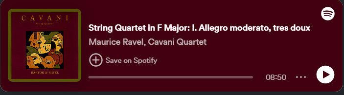
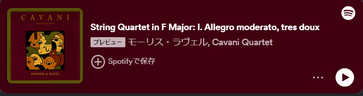

# Getting Started

<iframe style="border-radius:12px" src="https://open.spotify.com/embed/track/1teZCnh8MDg8aF691vPsfr?utm_source=generator" width="100%" height="152" frameBorder="0" allowfullscreen="" allow="autoplay; clipboard-write; encrypted-media; fullscreen; picture-in-picture" loading="lazy"></iframe>

Premium Spotify user will see:  

No Spotify account will see:  

